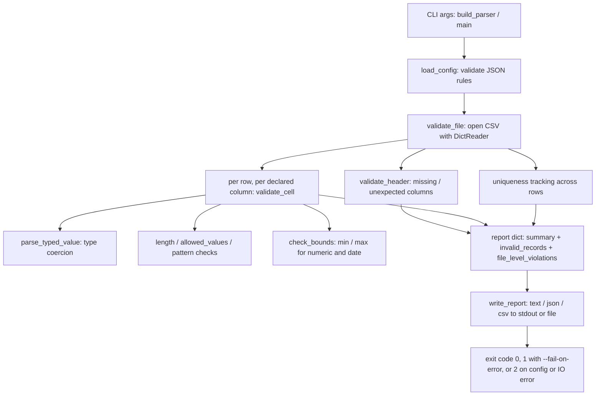

# 5-Day KT Plan — `vatsan912/Playerzero-demo`

**Audience:** new joiner onboarding onto this repo
**Branch created for this work:** `uddeshya-test` (branched from `origin/main`)
**Prepared:** 2026-09-10

---

## 0. Read this first: what the repo actually is

This is a **demo/sandbox repository, not a product codebase**. Sizing it honestly changes the plan:

| Branch | Contents |
| --- | --- |
| `main` (default) | A single empty file, `agents`. No code, no build, no CI, no tests. |
| `shubham-test` | The only real code: `validate_csv.py` (~440 lines, Python 3 stdlib only), `README.md`, and two example inputs under `examples/`. |
| `uddeshya-test` | Your new branch, created from `main`, so currently identical to `main`. |

Commit history is three commits total: `Create agents` → `Created a csv validator script.` → `Handle UTF-8 BOM in CSV headers so first-column rules apply`.

So "understand the repo" concretely means: **understand the CSV data-quality validator on `shubham-test`**, then use the remaining days to practise the engineering workflow (branching, changes, tests, PZ scenarios) on it. There is no service, database, frontend, or deployment to learn.

To see the code:

```bash
git clone https://github.com/vatsan912/Playerzero-demo.git && cd Playerzero-demo
git checkout shubham-test          # or: git show origin/shubham-test:validate_csv.py
python3 validate_csv.py examples/employees.csv -c examples/rules.employees.json
```

---

## 1. Architecture overview (the whole system, in one page)

`validate_csv.py` is a single-file CLI. It reads a CSV, checks each cell against rules declared in a JSON config, and prints a report of every violation. No dependencies, no state, no network.



**The five things worth internalising:**

1. **One report shape, three renderings.** `validate_file` always produces the same dict. `render_text`, `render_csv_rows`, and raw JSON are pure views over it. Add a rule → the JSON report gains it for free.
2. **`Violation` is the unit of currency.** Every check appends `Violation(row_number, column, rule, message, value)`. `row_number == 0` is the sentinel for file-level problems (missing/unexpected columns), which is how they get separated out in the report.
3. **Rule order inside a cell is fixed.** blank/required → type parse (bails out on failure) → length → allowed_values → pattern → min/max. A type failure short-circuits the bounds check but *not* the length/allowed/pattern checks that run before it.
4. **Config errors and data errors are different failures.** Bad JSON, unknown `type`, or an uncompilable `pattern` raise `ConfigError` → exit `2`. Data violations are normal output → exit `0` unless `--fail-on-error` is passed → exit `1`.
5. **Row numbers are 1-based file lines including the header**, so the first data row is `2`. Every report and message follows that convention.

**Verified behaviour** (run on `shubham-test` today, `examples/employees.csv`): 6 rows read, 2 valid, 4 invalid, 11 violations across `type` (4), `unique` (2), `min` (2), `allowed_values` (1), `pattern` (1), `required` (1). With `--fail-on-error` the same run exits `1`.

**Sharp edges to notice as you read** (good interview-style questions for yourself, all live in the code today):

- `pattern` is applied with `re.search`, not a full match — an unanchored pattern matches a substring. The example config anchors with `^...$`, which hides this.
- `check_bounds` parses `min`/`max` for dates using the column's `format`. A mismatch there raises `ValueError`, which surfaces as a generic "validation error" exit `2`, not as a config error.
- `unique` only records values that pass `validate_cell` and are non-empty (`if column in unique_seen and cleaned`), so duplicates among type-invalid values are never reported.
- `case_sensitive: false` affects both `allowed_values` and `unique` keying — one flag, two behaviours.
- The BOM fix (`lstrip("\ufeff")` on `fieldnames`, plus default encoding `utf-8-sig`) exists because Excel-exported CSVs otherwise broke the first column's rules. That's the only bug-fix commit in the repo — read its diff.

---

## 2. Day-by-day plan

Each day: an objective, concrete work, a done-check, and PlayerZero prompts to continue on your own.

### Day 1 — Orient the repo and your branch

**Objective:** know what exists, on which branch, and get the tool running.

- Confirm your branch: `git status -sb` should show `uddeshya-test`.
- List all branches and diff them: `git diff main origin/shubham-test --stat`. Understand *why* `main` is empty.
- Read `README.md` on `shubham-test` end to end — it is the spec for the config format.
- Run the tool in all three formats (`-f text`, `-f json`, `-f csv`) against the bundled example and compare the outputs. Same data, three shapes.

**Done when:** you can explain, without looking, what the 11 violations in the example are and why 2 rows are valid.

**Ask PlayerZero:**
- "Compare `main` and `shubham-test` in Playerzero-demo and summarise every file that differs."
- "Walk me through the CLI options in `validate_csv.py` and which ones change the report content versus its destination."

### Day 2 — Read the validation core

**Objective:** trace one cell from CSV byte to printed violation.

- Read `validate_file` → `validate_cell` → `parse_typed_value` → `check_bounds` in that order.
- On paper, trace the row `4,Dev Patel,dev.patel-example.com,Marketing,not-a-number,2020-13-45,maybe,12` and predict every violation. Then run it and check yourself.
- Map each of the 12 documented rules in the README to the exact code that enforces it.

**Done when:** your hand-traced violation list for that row matches the tool's output exactly, including rule names.

**Ask PlayerZero:**
- "Trace how a single CSV cell flows through validation in `validate_csv.py` and list the order in which rules are applied."
- "Which rules in `validate_csv.py` are skipped when a value fails its type check, and why?"

### Day 3 — Reporting, exit codes, and the sharp edges

**Objective:** understand the output contract and the known quirks.

- Read `render_text`, `render_csv_rows`, `write_report`. Note how `--max-records` truncates only the text report.
- Verify the three exit codes yourself: clean run, `--fail-on-error` with violations, and a deliberately broken config (invalid JSON, then an unsupported `type`).
- Reproduce each sharp edge from section 1 with a small config of your own. Write down which are bugs and which are intentional.

**Done when:** you have a short list of the quirks you reproduced, each with the config that triggers it and a one-line verdict (bug / by design).

**Ask PlayerZero:**
- "In `validate_csv.py`, is `pattern` a full match or a partial match, and what are the consequences for an unanchored pattern?"
- "Show me every code path in `validate_csv.py` that returns exit code 2."

### Day 4 — Make a change on your branch

**Objective:** exercise the full change workflow on real code.

- On `uddeshya-test`, bring the validator in (`git merge origin/shubham-test` or cherry-pick the two code commits) so you have something to modify. Note that this makes your branch diverge from `main` — expected.
- Implement one small, well-scoped improvement. Suggested, in increasing difficulty:
  1. A `--quiet` flag that suppresses the report and relies only on the exit code.
  2. Make `pattern` a full match (`re.fullmatch`) and update the README, or add an explicit `full_match` rule option — decide which is the better contract and say why.
  3. Report `unique` duplicates even when the value fails its type check.
- Follow the file's existing conventions: stdlib only, `%`-style formatting, `Violation` for every new finding, no new dependencies.
- Do **not** push or open a PR without asking — this is a shared demo repo.

**Done when:** the example run still produces the same 11 violations (or a difference you can justify), and your change is covered by a manual test you can rerun.

**Ask PlayerZero:**
- "Review my change on branch `uddeshya-test` in Playerzero-demo for consistency with the existing conventions in `validate_csv.py`."
- "What would break downstream if `pattern` became a full match instead of a partial match?"

### Day 5 — Lock in the behaviour and hand back

**Objective:** turn understanding into durable coverage and a written summary.

- Build a small regression fixture set: a clean CSV, one with a BOM, one with a missing declared column, one with duplicates that differ only in case.
- Ask PlayerZero to create scenarios for the invariants that matter: rule evaluation order, exit-code contract, the row-numbering convention, BOM tolerance, `case_sensitive: false` applying to both uniqueness and allowed values.
- Write a one-page summary of what you learned, the quirks you found, and what you'd fix next.

**Done when:** the scenarios exist, your fixtures run, and your summary is written.

**Ask PlayerZero:**
- "Create scenarios covering the exit-code contract and rule-evaluation order of the CSV validator in Playerzero-demo."
- "Given the CSV validator's current design, what are the three highest-value improvements and in what order?"

---

## 3. If the real target was a different repo

This plan is as deep as this repository allows — it is one CLI script. If the intent was to onboard onto a substantive codebase (a service, the Plane app, or another connected repo), say which one and this plan can be rebuilt against it with the same structure but real architectural depth.
